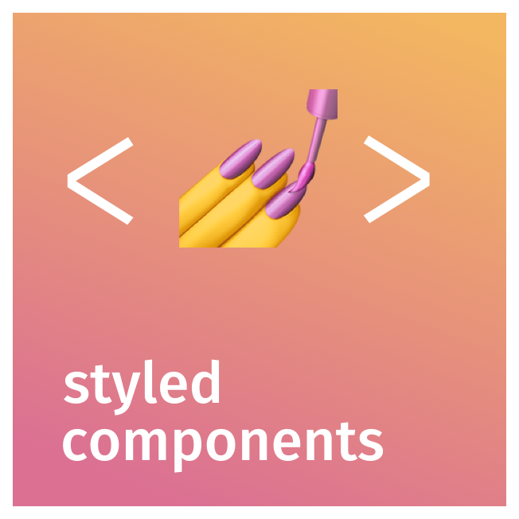

# Climbers

  

#### [웹사이트](https://www.climbers.kr)

## 프로젝트 소개

스포츠 클라이밍을 즐기는 사람들을 위해 클라이밍 센터 정보 제공, 모임/대회 주최, 커뮤니티 기능을 제공하는 커뮤니티 플랫폼 입니다.

 

## 웹사이트 화면

|             홈              |           클라이밍 센터 정보            |
| :-------------------------: | :---------------------------: |
|  |  |

|           센터 상세 페이지            |            커뮤니티            |
| :---------------------------: | :--------------------------: |
|  |  |

|             검색              |             소개             |
| :---------------------------: | :--------------------------: |
|  |  |

 

## 기술 스택

|               UI 라이브러리                |                      라우팅                       |                  상태관리                  |                비동기 상태 관리                 |            비동기 상태 관리                 |
| :----------------------------------------: | :-----------------------------------------------: | :----------------------------------------: | :---------------------------------------------: | :---------------------------------------------: |
|  |  |  |  |  |

|                        스타일링                        |             React UI Library             |                                                  |                                       |
| :----------------------------------------------------: | :---------------------------------------: | :---------------------------------------------------------: | :--------------------------------------------: |
|  |  |  |  |

|                서버 프레임워크                |                 NoSQL                  |
| :-----------------------------------------: | :---------------------------------------: |
|  |  |

 

 

 

## 프로젝트를 통해 배운 것들

* LocalStorage를 사용하는 방법
* Redux-Saga를 사용해서 비동기로 변하는 상태관리를 하는 방법
* Styeld components를 사용해서 각 컴포넌트를 CSS-in-JS 방식으로 스타일링 하는 방법
* Intersection Observer를 사용해 페이지네이션 구현하는 법
* Lazy loading을 통해 렌더링 성능 향상 시키는 법
* 오픈 API와 axios를 사용해서 데이터를 가져오는 방법
* mongoDB, mongoose를 이용해 서버에 데이터를 저장하는 법
* JWT 토큰을 사용해 사용자 인증을 하는 법
* multer, s3를 사용해 서버에 이미지 파일을 동적으로 저장하는 법 
